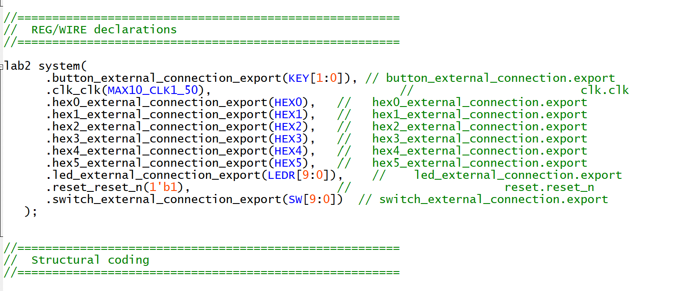
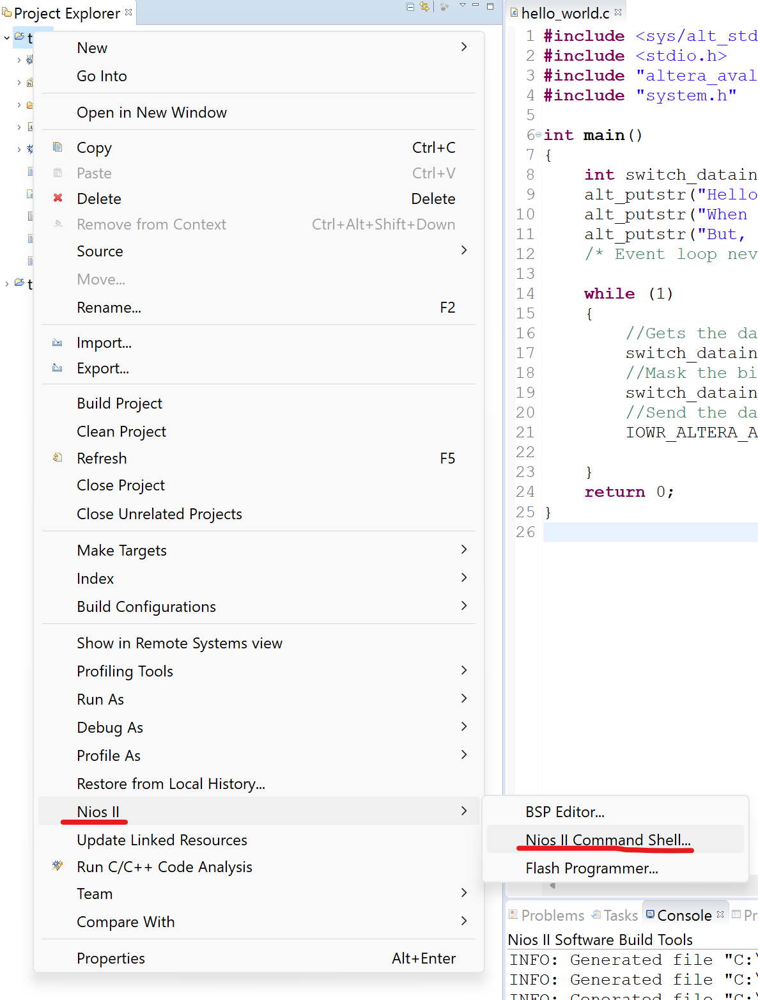

Department of Electrical & Electronic Engineering

Imperial College London


# Lab 2 – Design a NOIS2 System

## Objectives
By the end of this experiment, you should have achieved:
* Design a NIOS II system
* Understand the design process of a NIOSII system
* Program the Max 10 FPGA chip on the DE10-Lite board with your design
* Write code that runs on the processor NIOS to display a message on a terminal
* Explore and test the capabilities of your NIOS II system design


## Task 1: Design a NIOS2 System

The objective of the lab is to show you how you can instantiate a soft processor on your FPGA, connect it to various peripherals of the board, familiarize yourselves with how you can interface with these peripherals from the processor, and establish a communication with the host-PC and display a “hello” message on a terminal. 

Our target processor is a NIOSII, a soft-core processor that is provided by Intel and targets Intel FPGA devices.  The steps that you have to follow in order to complete this lab are described in the “Hello_World_Lab_manual_DE10_Lite.pdf”, and I will be referring to this document as manual. 

Please follow the instructions there.

Please note that the manual is using an older version of Quartus. As such, the 
process outlined is not directly applicable to your case. The points below address some of the issues that you need to be aware of.

Steps:
1. Please follow the steps outlined in the manual skipping section 1.0
2. In page 11, the manual refers to Qsys. In the new version of Quartus this has 
been changed to “Platform Designer”
3. Once you have completed page 26 before you assign the base addresses, add 
in a System ID Peripheral Intel FPAG IP unit and attach the clk and reset as 
expected. Furthermore connect the control_slave the cpu.data_master.
4. In page 30, the manual describes how to include the NIOS system that you 
have designed to a top-level module `DE10_LITE_Golden_Top.v`. The top level 
module provides the necessary code to connect a design to the specific 
components of the DE10-LITE board, this file is provided in `src/Golden_Top`. You can open the `nios_setup_v2_inst.v`
to see the code that describes your NIOS system. You need to copy the NIOS
declaration from the `nios_setup_v2_inst.v` into `DE10_LITE_Golden_Top.v`, 
and make the following changes in order to connect your NIOS system to the 
ports of the high level module as shown in the figure below. It is also worth to note that this is instantiating the qsys componenet (NIOS2 CPU system), so the module name should aligh with your system name (in this case I named it `lab2`), and `system` is simply the instance name.

    


5. In page 30, please ignore step 2
6. In page 30, in step 4, add the nios_setup_v2.qsys file (rather the .qip file)

If you have followed the above instructions, then you should be able now to compile 
the NIOS system for your board. Well Done! Please try to understand what you are 
doing in each step (rather than just clicking and following the instructions), as this 
enhances your understanding of how a processor system is designed. The next task 
is to write the software for your system.

## Task 2: Program a NIOS II system

Please follow the instructions of part 2 of the manual. Follow the manual and use the `hello_world_small` example. 

Once you reach step 15 on page 44, you can stop following the instructions. At this point follow the instructions below:

1. Right click hello_world_sw_bsp then go to Nios II -> Generate BSP
2. Right click hello_world_sw then select Build Project
    * If the building of a project is successful, then you should have a `.elf` file created in your “software” directory of your project. This is the file that needs to be downloaded to NIOS and executed.
3. Right click hello_world_sw then Run As -> Run Configurations
    * Inside the window, go the Target Connections tab
    * If you do not see anything inside Processors window, ensure your  board is properly connected. 
    * If there is a problem with the system ID, ensure that your qsys design is constructed properly, the system ID unit is correctly connected and  you have properly connected everything in your top level verilog file.
        * After this you can regenerate the BSP
        * If everything is properly connected, come back to this window and Refresh Connections and then Resolve Names.
    * If there is a problem with the timestamp, regenerate the BSP

---

(The following 4-9 is for VirtualBox)

4. Now open a new terminal window and go to the location of your current 
project
    * Assuming your quartus directory is `Documents/lab2/task1`, then your  project will be inside that directory instide `software/hello_world_sw`
    * You can use the `cd` command to get to the target directory: `cd /home/e2/Documents/lab2/task1/software/hello_world_sw`
5. Then type the command shell inside the terminal to launch the nios shell
    * To see what how the shell call works, you can look at the file `/home/e2/.bashrc`
6. Open a new terminal window, and start up another nios shell by typing `shell`
7. In this same terminal window type `nios2-terminal` This opens up a terminal window connected to the nios2
8. Return to the terminal window sitting at your `…/software/hello_world_sw` 
directory and type the following: `nios2-download –g hello_world_sw.elf`
    * This downloads the `.elf` file onto the FPGA to run the compiled C code 
on the NIOSII processor.
9. If everything is designed correctly, you will see the following in the terminal window where you ran nios2-terminal:
    ```bash
    Using cable "USB-Blaster [USB-0]", device 1, instance 0x00
    Pausing target processor: OK
    Initializing CPU cache (if present)
    OK
    Downloaded 29KB in 0.5s (58.0KB/s)
    Verified OK
    Starting processor at address 0x00010224
    ```
---

(The following is for a Native Environment (Windows))

4. Make sure you have your `hello_world_sw` and `hello_world_bsp` ready, and the `.elf` file has already been generated.
5. Make sure your have the correct `wsl` version installed, and also the `wsl` is pointing to the correct `Ubuntu` distribution. (See Troubleshooting for details).
6. Right click on the software module (the one that generated `.elf`), Click Nios II > NIOS II Command Shell
    
7. In the prompted command shell, go to where your `hello_world_sw` is using the `cd` command, and run `nios2-download –g hello_world_sw.elf`
8. If everything works correctly, you should get:
    ```bash
    Using cable "USB-Blaster [USB-0]", device 1, instance 0x00
    Pausing target processor: OK
    Initializing CPU cache (if present)
    OK
    Downloaded 29KB in 0.5s (58.0KB/s)
    Verified OK
    Starting processor at address 0x00010224
    ```

## Task 3: Extensions - Challenges

Having learned to program our system, let’s make something fun. 
Change the `hello_world.c` code to light up the LEDs in a sequence. 
For example, you can light up the LEDs from left to right in a specific pattern by controlling the time to light up LED x after having light up LED x-1. Use the two keys (push buttons) to produce two different patterns. Print any related information on the terminal. Think how to produce a delay in lighting up the LEDs.
You can also think how to use the slide switches and the six 7-segment display to provide more complicated set of patterns
## Troubleshooting

* In Quartus, if clicking Tools > NIOS2 Software Biuld Tools has no effect (eg. no window pops up). This is likely because you have not installed NIOS2 Eclipse properly. The new version of Quartus requires a separate install of NIOS2, which you should follow this link to finish your install: https://www.intel.com/content/www/us/en/docs/programmable/683525/21-3/windows-installation.html

* The NIOSII software requires an installation of wsl (Windows subsystem Linux), be aware this it *requires wsl 1 not wsl 1*.
    * Several packages are also required, so that one can run `make`, check the following link for details. https://www.intel.com/content/www/us/en/support/programmable/articles/000074066.html
    * `wsl --setdefault Ubuntu-18.04` sets the `wsl` distribution to the required version (18.04) Ubuntu.
    * `wsl --set-default-version 1` can move you back to wsl 1 if you are already on wsl 2.