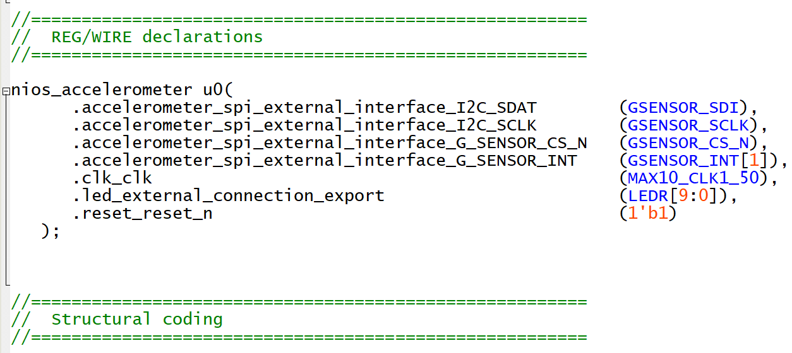
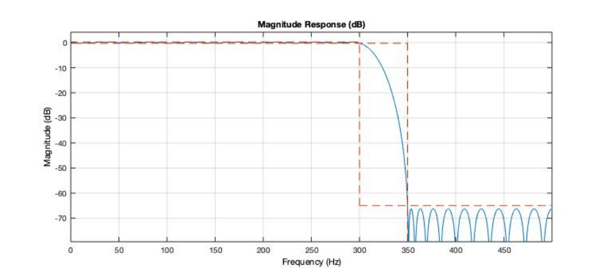

Department of Electrical & Electronic Engineering

Imperial College London


# Lab 3 –  Integrate an accelerometer with a NIOS

## Objectives
By the end of this experiment, you should have achieved:

* Designed a NIOS II system that interfaces with the accelerometer on DE10-
lite board
* Understand the design process of a NIOSII system and the SPI interface
* Learn how to read the acceleration value provided by the accelerometer
* Design a low-pass FIR filter to process the readings
* Investigate the impact of using low arithmetic precision to the quality of the results and the performance of your system.

## Task 1: Interface an accelerometer to a NIOS II system

The first objective of the lab is to show you how you can interface the Nios 
processor with an accelerometer. 

The DE10-lite comes with a digital accelerometer sensor module (ADXL345), commonly known as G-sensor. This G-sensor is a small, thin, ultralow power assumption 3-axis accelerometer with high-resolution measurement.

Digitalized output is formatted as 16-bit in two’s complement and can be accessed through SPI (3- and 4-wire) and I2C digital interfaces. 

SPI stands for Serial Peripheral Interface and it is one of the most common interfaces between a microprocessor and a peripheral with low-bandwidth requirements, and this is what we will use to interface the accelerometer to NIOS. 

Please follow the steps below to design your system. The main difference with the previous system, is that you will add an extra IP, the Accelerometer SPI mode, which will interface your NIOS to an SPI peripheral. As you should have experience by now how to design a NIOSII system, the steps below are given at a high-level.

Steps:
1. Open the provided DE10_LITE_Golden_Top project and launch Platform 
Designer
2. Add the following IPs:
    * Nios II Processor (select Nios II/e and click Finish)
    * On Chip Memory (change the size to 65536 and uncheck Initialize memory content)
    * JTAG UART
    * PIO for LED (10 bits, output)
    * Interval Timer
    * Accelerometer SPI Mode
3. Rename and connect your IPs as follows, ensuring that led and spi export 
external connections.
4. Assign Base Addresses: System -> Assign Base Address
5. Set both the reset vector memory and exception vector memory of cpu to 
onchip_memory.s1
6. Save the file as nios_accelerometer.qsys
7. Generate the HDL. 
8. Go back to Quartus, add the generated file into your project
9. Copy the code in nios_accelerometer_inst.v and paste them in `DE10_LITE_Golden_Top.v`. Modify the top level file code as follows: 
    
10. Compile your design.
11. Launch Eclipse
12. New -> Nios II Application and BSP from Template.
13. Choose .sopcinfo and choose Hello World Small as template
14. Replace the existing code with the code form led_accelerometer_main.c
15. Build the project in Eclipse and program your device using the terminal 
commands. The LEDs should indicate the titling position of your board.

## Task 2: Understanding of the code
Let’s familiarize ourselves with the code. Starting from the main(), you can see that after some initialization, the code gets into a while loop, where the code retrieves the value for the x_axis from the accelerometer, and calls the `convert_read()` function to map the x-axis reading to LED pattern. 

### Encoding of the x-value
The x-value is represented by 9 bits in 2’s complement format.

Converting the x value for LED display, the `convert_read()` function converts the `x_value` to led and level pair in order to be used to drive the lighting up of the LEDs. 

The led reflects the value of the top 3 bits, where the level captures the value of the 6 LSBs.

### Lighting up the LEDs
The writing of the value on the LEDs is performed at a specific rate dictated by the timer. The `sys_timer_isr()` is an interrupt service routine that is executed when a specific interrupt is received. 

As such, the processor will only execute this code at a specific intervals, letting the processor to focus on the execution of the while-loop 
code. 

You can also notice that the code uses pulse width modulation (PWM), which 
utilizes the convert_read() function, to create a smooth effect on the LEDS, creating a more “pleasant” indicator of the tilted angle of the board.

Using the `alt_print()` function, you can print on the host terminal the actual values of the x_read.

## Task 3: Implement an FIR filter to process the data

In this section, we will add a function to perform a low-pass filtering of the accelerometer values. We will use an FIR filter, and we will assume that the number of taps is fixed at compile time. 

Design a function that takes as input the current reading of the accelerometer, and returns its filtered version. 

Start by assuming a simple 5-tap filter with all coefficients to have the same value (i.e. 0.2). This will produce a moving average. 
The coefficients should be stored under float format, and the operations should be done using a single-precision floating point representation (i.e float).

Extend your code to implement an N-tap filter, where N is known. 
You can use matlab to generate a low-pass filter by providing the high-level specifications of the filter’s transfer function. 

You can use designfilt to design your filter and fvtool to visualize it.

For example (taken from Matlab): 
```
 % Design a lowpass FIR filter with passband frequency of 300 Hz, stopband 
frequency of 350 Hz, passband ripple of 0.5 dB, and stopband attenuation of 65 dB. 
The sample rate is 1 KHz. Apply the filter to a vector of random data.
>>lpFilt = designfilt('lowpassfir', 'PassbandFrequency', 300,...
 'StopbandFrequency', 350, 'PassbandRipple', 0.5, ...
 'StopbandAttenuation', 65, 'SampleRate', 1e3);
You can access the coefficients through: lpFilt.Coefficients
You can visualize the filter through the fvtool function:
>> fvtool(lpFilt);
```

You should get the following visualization.



### Challenge: Optimize the FIR
As the number of taps increases, the time taken for the execution of the filtering function increases linearly. 
As your NIOS (NIOS/e) does not have native support for floating point operations, all floating-point multiplications and additions are 
emulated through fixed-point additions. As such, the sampling rate of the 
accelerometer decreases. 

One way to increase the performance of the system is to consider converting the floating-point operations to fixed point ones. 

Write a new filtering function that takes as input a quantized version of the coefficients of your filter, and performs the necessary operations under a fixed-point format. 

You can use integers to represent the data. 

* What is the impact on the performance of the application (i.e. execution 
time of the filtering function)? 
* What is the impact on the transfer function? 

### Measuring the sampling frequency of the accelerometer

In every iteration of the while loop, NIOS samples the value of the accelerometer. We can estimate the average sampling frequency by using the time that it takes to  perform one iteration. 

As NIOS also needs to serve the interrupt for lighting up the 
LEDs, we can average over N iterations to estimate the average sampling 
frequency.

You need to add:

```c++
# include “alt_types.h”
# include “sys/times.h”
…
clock_t exec_t1, exec_t2;
exec_t1 = times(NULL); // get system time before starting the process
 
// The code that you want to time goes here
// some code…
// till here
exec_t2 = times(NULL); // get system time after finishing the process
printf(" proc time = %d ticks \n", int(exec_t2-exec_t1)); % print the number of ticks on the screen
```

Please note that the interval time functionality is not included by default in BSP. 

From Eclipse, right click on the BSP, go to NIOSII, and click on the BSP editor. In the Main tab, under Settings -> Common -> hal, you can find the timestamp_timer. Click on it, and indicate the timer as its value. This tells to the system which component (timer is the name of your interval timer in your design) to use for supporting time measurements. 

Click on Generate, and Exit. Generate the BSP 
again. Generate the project again

---

Note: 
1. You can find more information about the accelerometer in the DE10-Lite User Manual.
2. You can find more information about SPI here: 
https://www.analog.com/en/analog-dialogue/articles/introduction-to-spi-interface.html#
3. This part of the tutorial is based on: 
http://venividiwiki.ee.virginia.edu/mediawiki/index.php/Accelerometer_Controlled_LED